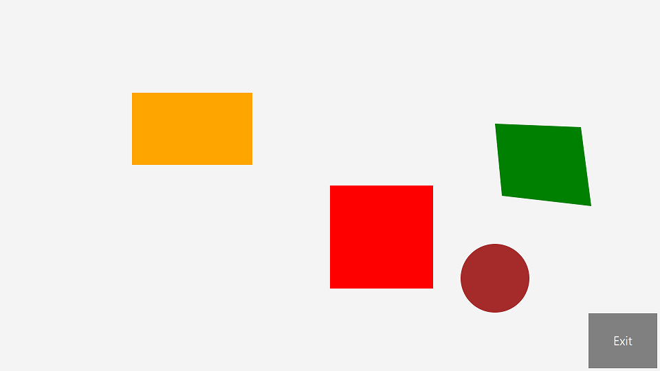

# MultitouchRST

A simple program in Java/JavaFX to demonstrate how to implement multitouch rotation, scaling and translation (RST) using JavaFX's listeners. Runs on computers where the OS supports multitouch (for the moment this is Windows 8 and 10; Windows 7, too, but you may have to install stuff for it).

The project is tailored for Netbeans.

(c) 2017 [Michael Kipp](http://michaelkipp.de)
